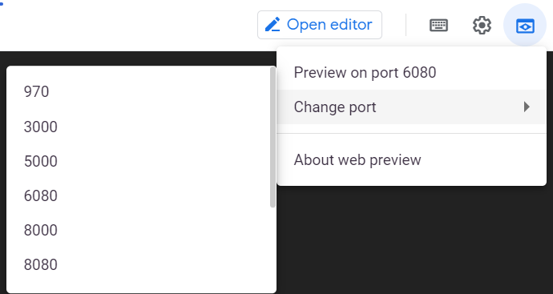

# Setup

## Create the python conda env
After cloning the project repository into your vm, make sure that the environment.yaml file is specified in the project's env folder with the required packages.
These commands will provide you a unique list of python packages needed to run the code.
- create a python env based on a list of packages from environment.yaml  
  ```conda env create -f env/environment.yaml```  
  
 - activate the env  
  ```conda activate env_nlp_text_class```  
  
 - in case of issue clean all the cache in conda  
   ```conda clean -a -y```  

## Update or delete the python conda env  
- update a python env based on a list of packages from environment.yaml  
  ```conda env update -f env/environment.yaml```  
  
- delete the env to recreate it when too many changes are done  
  ```conda env remove -n env_nlp_text_class```  

## Access of conda env in Jupyter notebook  
   To be able to see conda env in Jupyter notebook, you need:  
   - the following package in you base env:  
   ```conda install nb_conda```  

   - the following package in each env (this is the responsibility of the creator of the env to be sure it is in the env)  
   ```conda install ipykernel```  
   
   - check the configurationn of ```jupyter_notebook_config.py```  
     first check if you have a ```jupyter_notebook_config.py``` in one of the location given by  ```jupyter --paths```  
     if it doesn't exist, create it by running  ```jupyter notebook --generate-config ```  
     add or be sure you have the following: ```c.NotebookApp.kernel_spec_manager_class='nb_conda_kernels.manager.CondaKernelSpecManager'```

## Use JupyterLab   
- create the python conda env to run Jupyter Lab (or Jupyter Notebook)   
  ```conda env create -f env/jupyter-notebook.yaml```    
  (you should have nodejs installed with conda)  

- activate the env  
  ```conda activate jupyter-notebook```  
  
- install jupyter lab extensions  
  execute the shell script copy and paste each line
  ```. script/jupyter_lab/install_jupyterlab_extension.sh ```

- start Jupyter Lab where is the env 'jupyter-notebook' activated  
  ```jupyter lab```  
  
## TensorBoard (as of 18.04.2010)
- open a Jupyter Notebook and execute the cell with TensorBoard:
```
%load_ext tensorboard  
%tensorboard  --logdir {path_tensorboad_output} \  
--host 0.0.0.0 \ 
--port 6006
```  
  or you can do the same in a Terminal  
``` tensorboard  --logdir path_tensorboad_output --host 0.0.0.0 --port 6006 ```  
- open CloudShell in the GCP console  
- execute the following command to do port forwarding  
  ```ssh -i ~/.ssh/id_rsa -L localhost:6080:localhost:6006 user_name@external_ip```    
 or   
 ```gcloud compute ssh user_name@instance_name --ssh-key-file ~/.ssh/id_rsa  --project xxx --zone xxx  -- -L 6080:localhost:6006```
- then in CloudShell, click on ```Web Preview``` and watch for port 6080  
   
- you can check by SSH the underlying AI Platform notebook VM and after running jupyter lab execute the command below to see if the port 6006 is active  
```netstat -vanp --tcp | grep 6006```   

